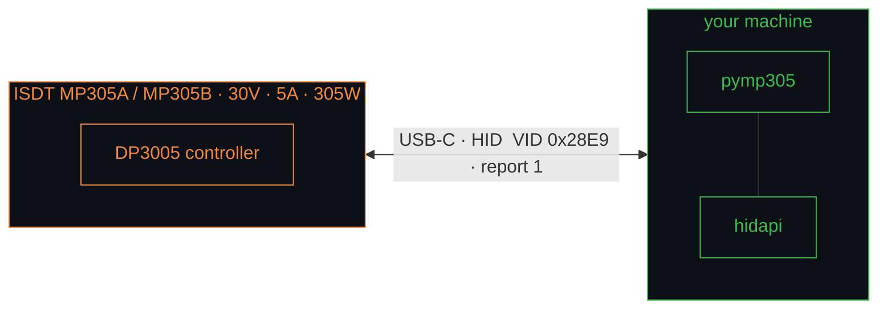

<div align="center">

# ⚡ pymp305

**An unofficial Python driver for the [ISDT MP305](https://www.isdt.co/) smart bench power supplies — both MP305A and MP305B.**

Control voltage, current, and output over USB — no app, no cloud, just Python.

[](https://pypi.org/project/pymp305/)
[](https://github.com/nemanjan00/pymp305/actions/workflows/test.yml)
[](./LICENSE)
[](https://www.python.org)
[](./PROTOCOL.md)
[](#-status-not-yet-tested-on-hardware)

</div>

> # 🚨 STATUS: NOT YET TESTED ON HARDWARE
>
> **Every line of this library was reverse-engineered from ISDT's WebLink web app — it has
> not yet been run against a physical MP305A/MP305B.** The framing, decoding, units, and
> command/firmware encoding are covered by golden-vector tests, but nothing here has talked
> to a real device. Expect rough edges on first contact (HID report size, the BLE binding
> handshake, exact charge/PD field meanings). **The OTA / firmware-flashing code is
> especially unverified — treat it as dangerous.** Use at your own risk, and please open an
> issue with results once you try it on actual hardware. See [Bring-up](./python/README.md).



---

## Why

The MP305 is a slick little programmable PSU, but the only ways to drive it are ISDT's
phone app (BLE) and their [WebLink](https://www.isdt.co/weblink/) web app (WebHID).
This library speaks the **same USB-HID protocol the web app uses**, so you can script your
bench from Python: automated test rigs, battery cycling, data logging, CI for hardware.

**MP305A and MP305B share one controller and protocol** — the same code drives both. The
only model-specific behaviour (a few error-code mappings) is detected automatically from
the device name. The protocol is fully documented in **[PROTOCOL.md](./PROTOCOL.md)**.

> ⚠️ **Heads-up:** the framing/decoding layer is covered by passing golden-vector tests,
> but this has **not yet been validated against physical hardware**. First-run bring-up
> notes are in [`python/README.md`](./python/README.md). Reports welcome!

## Features

- 🔌 **Zero-config connect** — auto-discovers the device by USB vendor id
- 🎛️ **Full PSU control** — set V/I, toggle output, take/release remote control
- 📈 **Live telemetry** — voltage, current, power, energy, temperature, runtime, errors
- 🔋 **Charge mode** — battery charging by chemistry / cells / current
- 🤝 **A & B in one driver** — `MP305`, with `MP305A` / `MP305B` aliases; model auto-detected
- 🧱 **Clean layers** — pure `protocol.py` framing you can reuse over BLE too
- 🧪 **Tested without hardware** — checksum/stuffing/units verified by golden vectors
- 🪪 **MIT licensed**, no ISDT code shipped (see *Clean-room* below)

## Install

```bash
pip install pymp305
```

`hidapi` comes in as a dependency. Linux: add a udev rule so you don't need root —
see [`python/README.md`](./python/README.md#install).

<details><summary>From source (development)</summary>

```bash
git clone https://github.com/nemanjan00/pymp305 && cd pymp305/python
pip install -e .
```
</details>

## Quick start

```python
from pymp305 import MP305

with MP305.open() as psu:
    print(psu.hardware_info())                      # name (MP305A/B) + firmware versions

    psu.set_output(voltage=5.0, current=1.0, on=True)   # remote control + output ON

    st = psu.read_state()
    print(f"{st.voltage:.2f} V  {st.current:.3f} A  {st.power:.2f} W  {st.temperature} °C")

    psu.output_off()
    psu.release_remote()                            # give the front panel control back
```

`MP305A` and `MP305B` are aliases of `MP305` if you prefer to be explicit. Live-streaming
example: [`python/examples/basic.py`](./python/examples/basic.py).

## Protocol at a glance

| What | Command | Response | Notes |
|------|:-------:|:--------:|-------|
| Hardware / firmware info | `0xE0` | `0xE1` | device id + HW/boot/app versions |
| Live state | `0xBD` / `0xC2` | `0xC3` | V·I·W·Wh·°C·output·errors |
| System settings | `0xC4` / `0xC6` | `0xC5` / `0xC7` | brightness, OCP, auto-off… |
| **Set output / V / I** | `0xC8` | `0xC9` | the main control command |
| Charge mode | `0xEE` | `0xEF` | LiHv/LiPo/LiFe/Pb/NiMH… |
| Reboot / bootloader | `0xFCCA` / `0xF0AC` | — | danger zone |

Frames are `[len, 0xAA, 0x12, paylen, cmd, …LE-payload, checksum]` with `0xAA` byte-stuffing.
Full field-level spec, units, and error tables: **[PROTOCOL.md](./PROTOCOL.md)**.

## Repo layout

```
PROTOCOL.md                      # the wire protocol, documented
tools/fetch_weblink_sources.py   # reproduce the RE material from ISDT's public source-maps
python/
    pymp305/                     # the library (protocol · responses · device)
    examples/basic.py
    tests/test_protocol.py       # golden-vector framing tests (no hardware needed)
reversing/                       # git-ignored: recovered ISDT source, kept local only
```

## Clean-room & copyright

This repository contains **only original work** (the Python driver, the protocol
documentation, and the fetch tool). It does **not** redistribute any ISDT code.

ISDT's WebLink app is their copyright. The reverse-engineering material derived from it
lives under `reversing/`, which is **git-ignored and never published**. To regenerate it
locally from ISDT's *public* source-maps:

```bash
python tools/fetch_weblink_sources.py     # -> reversing/recovered-src/  (local only)
```

Protocol/interoperability facts (command bytes, field layouts) are not themselves
copyrightable; the implementation here is independent.

## Roadmap

- [ ] Validate against real hardware (incoming 🛒)
- [ ] BLE transport via `bleak` (same command set, reuses `responses.py`)
- [ ] USB-PD (PDO) and programmable-sequence helpers
- [ ] OTA firmware flashing

## License

[MIT](./LICENSE) — *Not affiliated with or endorsed by ISDT. "MP305", "MP305A", "MP305B"
and "ISDT" are trademarks of their respective owner.*
