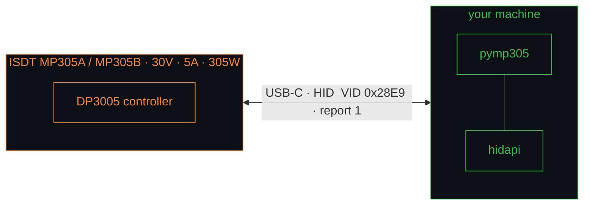
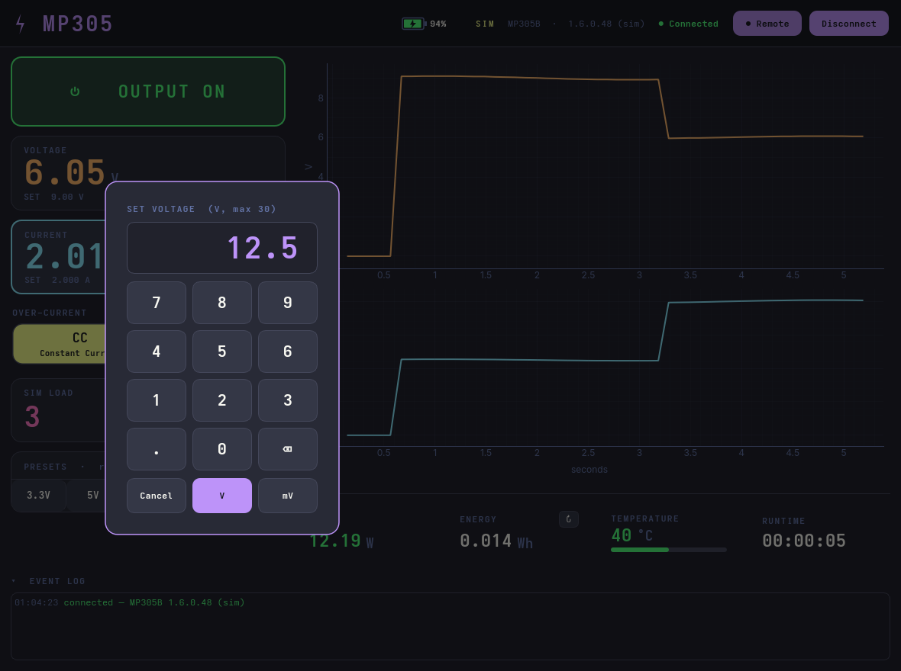

<div align="center">

# ⚡ pymp305

**An unofficial Python driver for the [ISDT MP305](https://www.isdt.co/) smart bench power supplies — both MP305A and MP305B.**

Control voltage, current, and output over USB — no app, no cloud, just Python.

[](https://pypi.org/project/pymp305/)
[](https://github.com/nemanjan00/pymp305/actions/workflows/test.yml)
[](./LICENSE)
[](https://www.python.org)
[](./PROTOCOL.md)
[-yellow.svg)](#-status-partially-verified-on-hardware)

</div>

> # ⚡ STATUS: PARTIALLY VERIFIED ON HARDWARE
>
> This library was reverse-engineered from ISDT's WebLink web app. As of **v0.6.0 it has been
> run against a physical MP305B** (app V1.6.0.46):
>
> - ✅ **Verified working (USB-HID):** all telemetry reads (device info, live V/I/W/temp,
>   system settings, charge state, PDO/e-marker, program list/steps), full **DC PSU control**
>   (set V/I, output on/off, CV/CC, over-current CC↔OCP), **mode switching** (`set_mode`) across
>   DC / programmable / USB-PD / charge, **USB-PD source control** (advertise-set + output
>   on/off — negotiated against a real PD sink at 15 V), and **programmable sequences**
>   (read / write / run — writes confirmed by read-back).
> - ✅ **Verified over Bluetooth:** `MP305BLE` reads **and** control (touch-gated remote
>   handshake), same API as USB.
> - ⚠️ **Not yet verified:** **charge control** (the handshake runs but exercising it needs a
>   real battery pack), and everything on the **MP305A** (only the MP305B has been tested).
> - 🚫 **Do not use untested:** the **OTA / firmware-flashing** path (`flash()`),
>   `soft_reset()`, and calibration remain **unverified — treat as dangerous.**
>
> Getting the driver talking to real hardware needed several protocol fixes (response header
> group `0x21`, a `0xBD`→`0xC2` fallback, the two-step remote handshake); see the CHANGELOG.
> Use at your own risk, and please open an issue with results — MP305A reports especially
> welcome. See [Bring-up](./python/README.md).



---

## Why

The MP305 is a slick little programmable PSU, but the only ways to drive it are ISDT's
phone app (BLE) and their [WebLink](https://www.isdt.co/weblink/) web app (WebHID).
This library speaks the **same USB-HID protocol the web app uses**, so you can script your
bench from Python: automated test rigs, battery cycling, data logging, CI for hardware.

**MP305A and MP305B share one controller and protocol** — the same code drives both. The
only model-specific behaviour (a few error-code mappings) is detected automatically from
the device name. The protocol is fully documented in **[PROTOCOL.md](./PROTOCOL.md)**.

> ⚠️ **Heads-up:** DC PSU control, all telemetry reads, mode switching, USB-PD source control,
> programmable sequences (incl. writes), and BLE control are verified on a physical **MP305B**;
> **charge control** and the whole **MP305A** are not yet confirmed. Bring-up notes are in
> [`python/README.md`](./python/README.md). Reports welcome — especially from MP305A owners!

## Features

- 🔌 **Zero-config connect** — auto-discovers the device by USB vendor id
- 🎛️ **Full PSU control** — set V/I, toggle output, take/release remote control
- 📈 **Live telemetry** — voltage, current, power, energy, temperature, runtime, errors
- 🔋 **Charge mode** — battery charging by chemistry / cells / current
- 🔌 **USB-PD + programmable** — read/select/run PD (PDO) profiles and stored output sequences, and *define* them (writes)
- 🔎 **USB-C e-marker** — read the attached cable's e-marker (speed/format)
- 📡 **USB *and* Bluetooth** — `MP305` over USB-HID, `MP305BLE` (async, `bleak`) over BLE — same API
- 💾 **Firmware tooling** — decrypt official `.bin` images (key ships in the header) + experimental OTA flashing (HID & BLE)
- 🖥️ **Desktop GUI** — Dracula-themed PyQt6 dashboard with live charts + a no-hardware simulator (see [`gui/`](./gui))
- 🛟 **Safety-gated** — dangerous paths gated: OTA behind `allow_untested_ota=True`, `soft_reset()` behind `confirm=True`
- 🤝 **A & B in one driver** — `MP305`, with `MP305A` / `MP305B` aliases; model auto-detected
- 🧱 **Clean layers** — pure `protocol.py` framing shared by both transports
- 🧪 **Golden-vector tested** (framing/units/firmware-decrypt) + **verified on MP305B hardware** (USB & BLE)
- 🪪 **MIT licensed**, no ISDT code shipped (see *Clean-room* below)

## Install

```bash
pip install pymp305          # USB-HID
pip install pymp305[ble]     # + Bluetooth (bleak)
```

`hidapi` comes in as a dependency. Linux: add a udev rule so you don't need root —
see [`python/README.md`](./python/README.md#install).

<details><summary>From source (development)</summary>

```bash
git clone https://github.com/nemanjan00/pymp305 && cd pymp305/python
pip install -e .
```
</details>

## Quick start

```python
from pymp305 import MP305

with MP305.open() as psu:
    print(psu.hardware_info())                      # name (MP305A/B) + firmware versions

    psu.set_output(voltage=5.0, current=1.0, on=True)   # remote control + output ON

    st = psu.read_state()
    print(f"{st.voltage:.2f} V  {st.current:.3f} A  {st.power:.2f} W  {st.temperature} °C")

    psu.output_off()
    psu.release_remote()                            # give the front panel control back
```

`MP305A` and `MP305B` are aliases of `MP305` if you prefer to be explicit. Live-streaming
example: [`python/examples/basic.py`](./python/examples/basic.py).

### Bluetooth (async)

```python
import asyncio
from pymp305.ble import MP305BLE

async def main():
    psu = await MP305BLE.open()              # scan + connect + bind
    await psu.set_output(voltage=5.0, current=1.0, on=True)
    print(await psu.read_state())
    await psu.close()

asyncio.run(main())
```

### Firmware (decrypt / repair)

Official `.bin` images are reversibly obfuscated (the key is in the header), so they decrypt
with no secrets — useful for inspection or keeping a known-good image to restore after a bad
flash (the protocol can't read flash back, so you can't dump the unit's current firmware).

```bash
python tools/fetch_firmware.py               # download + decrypt official images -> reversing/ (git-ignored)
python python/examples/ota_inspect.py firmware.bin
```
The decryptor is verified against ISDT's released MP305A/MP305B images (checksums pass and the
decrypted ARM vector table + embedded model id check out). **OTA *writing* is still untested —
see the banner.**

## Desktop GUI

A Dracula-themed PyQt6 dashboard in [`gui/`](./gui), designed for a **trackball-only**
lab PC (no keyboard, no accidental changes): per-channel instrument cards (measured + tap-to-set
keypad), a big output card-button, an over-current `CC|OCP` toggle, battery + temperature, and
rolling V/I charts. **Mode tabs** mirror the device — **DC PSU**, **Charge** (chemistry / cells /
current), and **USB-PD** (tap a profile; read the cable's e-marker). Eased read-outs and animated
toggles. Runs against a real MP305 or a built-in simulator.


Tap any value for the on-screen keypad (digits **and** unit buttons — no keyboard needed):



```bash
cd gui && pip install -r requirements.txt && python run.py --demo
```

## Protocol at a glance

| What | Command | Response | Notes |
|------|:-------:|:--------:|-------|
| Hardware / firmware info | `0xE0` | `0xE1` | device id + HW/boot/app versions |
| Live state | `0xBD` / `0xC2` | `0xC3` | V·I·W·Wh·°C·output·errors |
| System settings | `0xC4` / `0xC6` | `0xC5` / `0xC7` | brightness, OCP, auto-off… |
| **Set output / V / I** | `0xC8` | `0xC9` | the main control command |
| Charge mode | `0xEC` / `0xEE` | `0xED` / `0xEF` | LiHv/LiPo/LiFe/Pb/NiMH… |
| USB-PD profiles | `0xD0` / `0xE8` | `0xD1` / `0xE9` | read PDO / select PDO |
| Programmable sequences | `0xD4` / `0xD8` / `0xE2` | `0xD5` / `0xD9` / `0xE3` | list / read steps / run |
| OTA | `0xF2`/`0xF4`/`0xF6` (HID), `0x80`+ (BLE) | `0xF3`/`0xF5`/`0xF7` | erase / write / verify |
| Reboot / bootloader | `0xFCCA` / `0xF0AC` | — | danger zone |

Over **USB-HID** frames are `[len, 0xAA, 0x12, paylen, cmd, …LE-payload, checksum]` with
`0xAA` byte-stuffing; over **BLE** they're just `[0x12, cmd, …LE-payload]`.
Full field-level spec, units, and error tables: **[PROTOCOL.md](./PROTOCOL.md)**.

## Repo layout

```
PROTOCOL.md                      # the wire protocol, documented
tools/fetch_weblink_sources.py   # reproduce the RE material from ISDT's public source-maps
tools/fetch_firmware.py          # download + decrypt official firmware -> reversing/
python/
    pymp305/                     # protocol · responses · commands · device (HID) · ble · ota
    examples/                    # basic.py · ble.py · ota_inspect.py
    tests/                       # golden-vector tests (no hardware needed)
reversing/                       # git-ignored: recovered ISDT source + firmware, local only
```

## Clean-room & copyright

This repository contains **only original work** (the Python driver, the protocol
documentation, and the fetch tool). It does **not** redistribute any ISDT code.

ISDT's WebLink app is their copyright. The reverse-engineering material derived from it
lives under `reversing/`, which is **git-ignored and never published**. To regenerate it
locally from ISDT's *public* source-maps:

```bash
python tools/fetch_weblink_sources.py     # -> reversing/recovered-src/  (local only)
```

Protocol/interoperability facts (command bytes, field layouts) are not themselves
copyrightable; the implementation here is independent.

## Roadmap

- [x] **Validate against real hardware** — MP305B verified (USB & BLE): reads, DC control,
      mode switching, USB-PD source control, programmable read/write/run. Remaining: charge
      control (needs a pack), MP305A, and OTA/`soft_reset` (still gated as dangerous)
- [x] BLE transport via `bleak` (`MP305BLE`, async — same command set, reuses `responses.py`)
- [x] USB-PD (PDO) + programmable-sequence helpers — read, select/run, **and write**
- [x] USB-C e-marker reader
- [x] OTA firmware flashing (HID **and** BLE) + firmware decryption (decrypt validated against
      official images; flashing itself still unverified on hardware)
- [x] Typed package (`py.typed`), one-time untested warning, OTA gated behind `allow_untested_ota`

## License

[MIT](./LICENSE) — *Not affiliated with or endorsed by ISDT. "MP305", "MP305A", "MP305B"
and "ISDT" are trademarks of their respective owner.*
