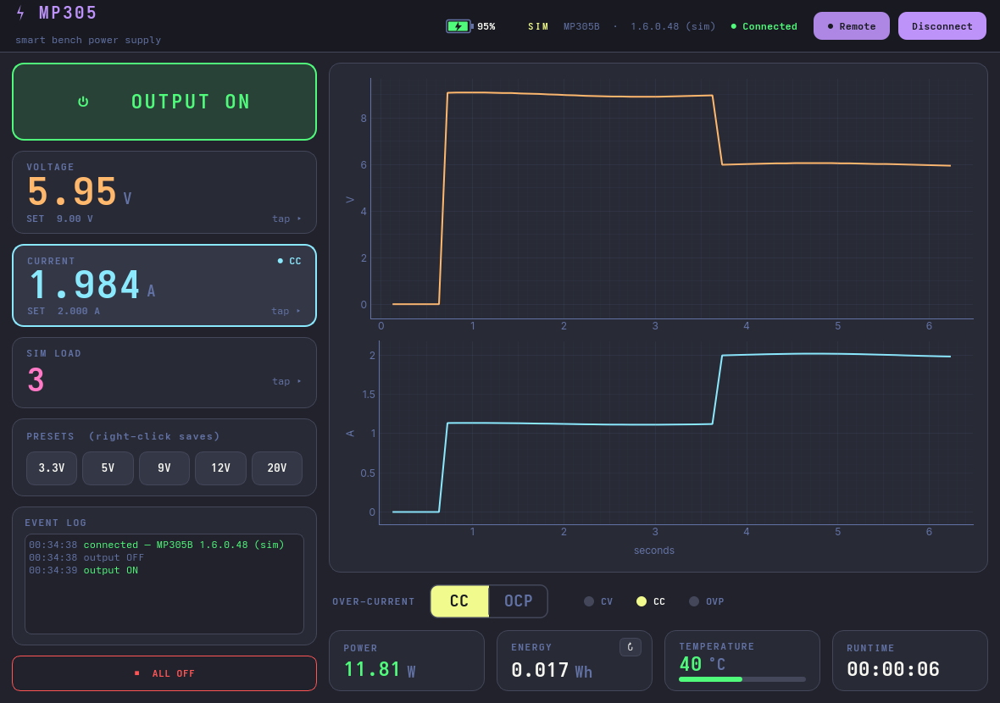

# MP305 GUI

A modern **Dracula-themed** desktop dashboard for the ISDT MP305, built on
[`pymp305`](../python) with **PyQt6** + **pyqtgraph**.



Designed for a **trackball-only lab PC — no keyboard, and no accidental changes.** Every
action is a deliberate pointer click on a large target; nothing alters the output by a
casual gesture (in particular there is **no scroll-to-change** — a stray scroll must never
move the voltage on a live DUT).

> Runs against a real MP305 (via `pymp305`/`hidapi`) **or** a built-in simulator, so you can
> try it with no hardware — the shot above is the simulator driving a CV→CC transition. Like
> the library, the hardware path is **not yet validated on a real device.**

## Run

```bash
cd gui
pip install -r requirements.txt
python run.py            # auto: real MP305 if present, else the simulator
python run.py --demo     # force the simulator
```

## On screen

- **Output** — one big green/red card-button (huge hit target; state unmistakable).
- **Voltage / Current channel cards** — measured value (big) + a tappable **SET** sub-row in
  one card; the **limiting channel highlights** (border + tag) so **CV vs CC is obvious**.
- **Keypad** — tap any channel to open an on-screen pad with **digit + unit** buttons
  (`9`→`V`, `1500`→`mA`); exact entry, no keyboard.
- **Presets** — one-click V+I rails; **right-click a preset to save** the current setpoint.
- **Over-current toggle** `CC | OCP` — a real *control* (sets the device's `currentOver`:
  CC = current-limit, OCP = trip the output). Distinct from the **CV / CC / OVP status lamps**
  (CV/CC come from the device's regulation status); the OCP cell doubles as its trip lamp.
- **Battery** (internal cell) — %, charging bolt, colour by level, **pulsing red near-empty**;
  click to toggle charge/discharge (sim).
- **Temperature** bar gauge, **Power**, **Energy**, **Runtime**.
- **Live charts** (60 s) of measured voltage and current.
- **Event log** (timestamped, colour-coded).
- **Sim load** (Ω) so you can watch CV→CC behaviour with no hardware.

## Architecture

- `mp305gui/backend.py` — `RealBackend` (wraps `pymp305.MP305`) + `SimBackend`, same surface.
- `mp305gui/worker.py` — a `QThread` worker; all (blocking) device I/O runs off the UI thread.
- `mp305gui/app.py` — the dashboard, custom widgets (output button, channel cards, keypad,
  CV|CC indicator, battery, temp gauge, lamps), charts.
- `mp305gui/theme.py` — the Dracula palette + Qt stylesheet.

Kept as a **separate package** so the core `pymp305` library stays dependency-free (no Qt).
