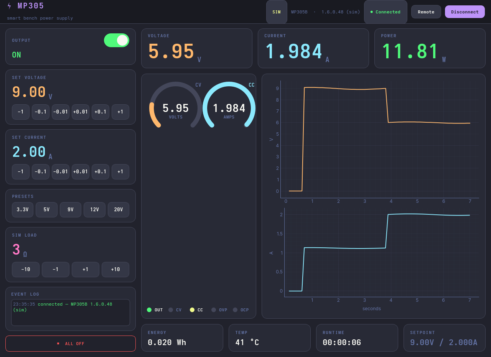
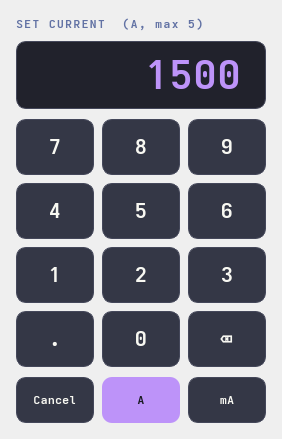

# MP305 GUI

A modern **Dracula-themed** desktop dashboard for the ISDT MP305, built on
[`pymp305`](../python) with **PyQt6** + **pyqtgraph**.



Designed for a **trackball-only lab PC — no keyboard required.** Every value is settable and
every action triggerable with the pointer alone. UI/UX takes cues from ISDT's WebLink and the
hardware's dense single-screen layout, modernized.

> Runs against a real MP305 (via `pymp305`/`hidapi`) **or** a built-in simulator, so you can
> try it with no hardware — the shot above is the simulator driving a CV→CC transition. Like
> the library, the hardware path is **not yet validated on a real device.**

## Run

```bash
cd gui
pip install -r requirements.txt
python run.py            # auto: real MP305 if present, else the simulator
python run.py --demo     # force the simulator
```

## Pointer-only input (no keyboard)

Four complementary ways to set a value, all trackball-friendly (hit targets ≥ 40 px):

- **Stepper chips** `−1 −0.1 −0.01 / +0.01 +0.1 +1` beside each setpoint — fine nudges.
- **Scroll-to-nudge** — the trackball scroll ring bumps the value under the pointer.
- **Presets** — one-click common rails (3.3 / 5 / 9 / 12 / 20 V).
- **On-screen keypad** — tap the big number for an exact entry pad with **digit + unit**
  buttons (e.g. `9` → `V`, or `1500` → `mA`).



## What's on screen

- Hero **V / I / P** readouts (orange / cyan / green, monospace tabular figures).
- **Dual CV/CC arc gauges** (volts + amps) with a fused CV/CC tag that highlights the
  limiting quantity — no wasted real-estate.
- **Status lamps**: OUT / CV / CC / OVP / OCP.
- **Output toggle**, remote take/release, **All Off**.
- **Rolling charts** (60 s) of measured voltage and current.
- **Event log** (timestamped, colour-coded) that absorbs the left column's slack.
- **Sim load** control (Ω) so you can watch CV→CC behaviour.

## Architecture

- `mp305gui/backend.py` — `RealBackend` (wraps `pymp305.MP305`) + `SimBackend`, same surface.
- `mp305gui/worker.py` — a `QThread` worker; all (blocking) device I/O runs off the UI thread,
  polled at ~10 Hz.
- `mp305gui/app.py` — the dashboard, custom widgets (toggle, arc gauge, lamp, keypad), charts.
- `mp305gui/theme.py` — the Dracula palette + Qt stylesheet.

Kept as a **separate package** so the core `pymp305` library stays dependency-free (no Qt).
