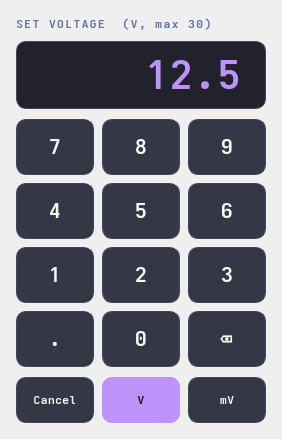

# MP305 GUI

A modern **Dracula-themed** desktop dashboard for the ISDT MP305, built on
[`pymp305`](../python) with **PyQt6** + **pyqtgraph**.


Designed for a **trackball-only lab PC — no keyboard, and no accidental changes.** Every
action is a deliberate pointer click on a large target; nothing alters the output by a
casual gesture (in particular there is **no scroll-to-change** — a stray scroll must never
move the voltage on a live DUT).

> Runs against a real MP305 (via `pymp305`/`hidapi`) **or** a built-in simulator, so you can
> try it with no hardware — the shot above is the simulator driving a CV→CC transition. Like
> the library, the hardware path is **not yet validated on a real device.**

## Run

```bash
cd gui
pip install -r requirements.txt
python run.py            # auto: real MP305 if present, else the simulator
python run.py --demo     # force the simulator
```

## On screen

Design language: **a card means it's interactive** (click/tap), flat means read-only —
so the left column is controls (cards), the right column is read-outs (flat).

Left — controls:
- **Output** — one big green/red card-button (huge hit target; state unmistakable). It *is*
  the on/off, so there's no separate "all off".
- **Voltage / Current channel cards** — measured value (big) + a tappable **SET** sub-row;
  the active channel highlights with a `CV`/`CC` tag (the device's regulation status).
- **Keypad** — tap a channel for an on-screen pad with **digit + unit** buttons
  (`9`→`V`, `1500`→`mA`); exact entry, no keyboard.
- **Over-current** — a `CC | OCP` toggle (with descriptions, like the WebLink): the device's
  `currentOver` setting — `CC` = current-limit, `OCP` = trip the output.
- **Presets** — one-click V+I rails; **right-click a preset to save** the current setpoint.
- **Sim load** (Ω) so you can watch CV→CC behaviour (and OCP trips) with no hardware.

Right — read-outs (flat):
- **Live charts** (60 s) of measured voltage and current.
- **Power / Energy / Temperature gauge / Runtime** (Energy has a `↻` reset — the one button).
- **Event log** — timestamped, colour-coded; **OVP/OCP trips appear here as alerts**, not as
  LEDs (matching the WebLink, which has no protection lamps either).

Top bar: **battery** (internal cell — %, charging bolt, pulsing-red near-empty, click to
toggle charge/discharge in sim), SIM/USB, model/fw, connection, Remote, Connect/Disconnect.

The on-screen keypad (tap any value to set it exactly — digits **and** unit buttons, no keyboard):



## Architecture

- `mp305gui/backend.py` — `RealBackend` (wraps `pymp305.MP305`) + `SimBackend`, same surface.
- `mp305gui/worker.py` — a `QThread` worker; all (blocking) device I/O runs off the UI thread.
- `mp305gui/app.py` — the dashboard, custom widgets (output button, channel cards, keypad,
  CV|CC indicator, battery, temp gauge, lamps), charts.
- `mp305gui/theme.py` — the Dracula palette + Qt stylesheet.

Kept as a **separate package** so the core `pymp305` library stays dependency-free (no Qt).
