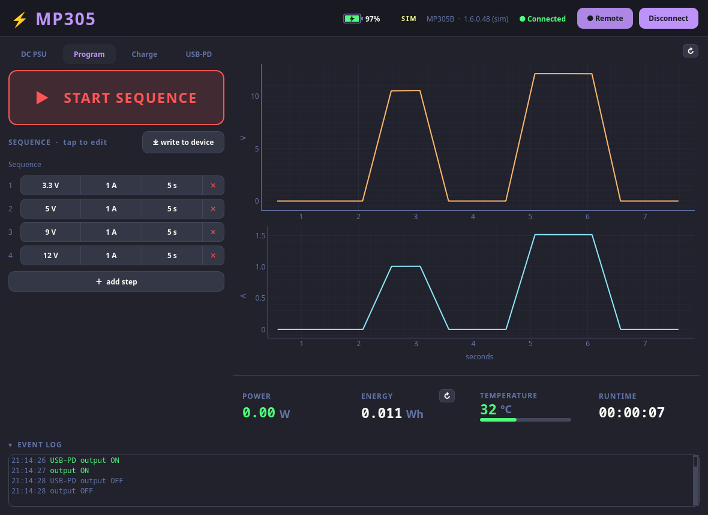
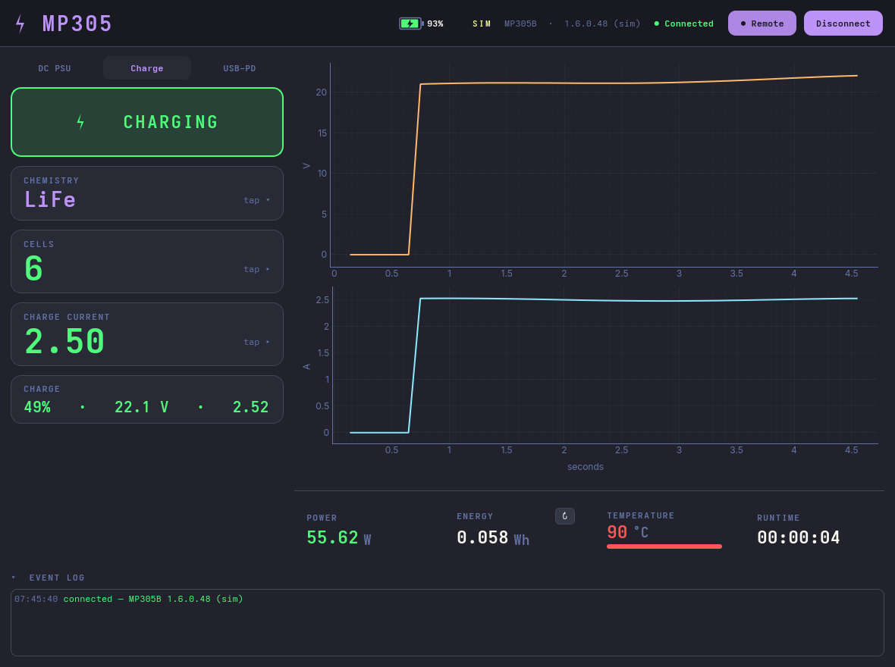
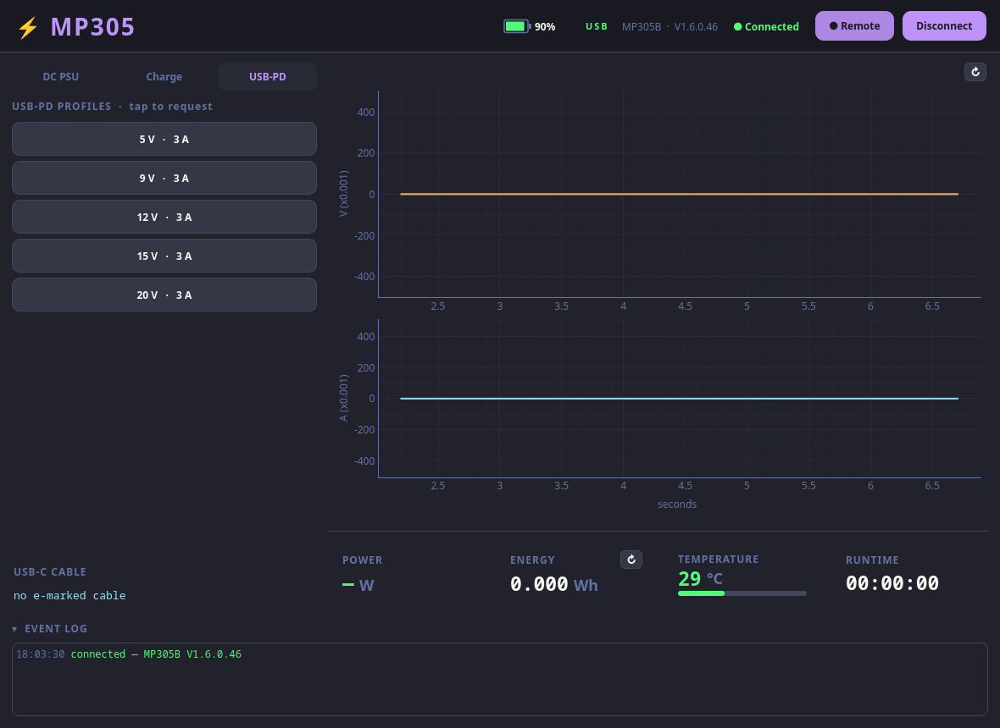

# MP305 GUI

A modern **Dracula-themed** desktop dashboard for the ISDT MP305, built on
[`pymp305`](../python) with **PyQt6** + **pyqtgraph**.


Designed for a **trackball-only lab PC — no keyboard, and no accidental changes.** Every
action is a deliberate pointer click on a large target; nothing alters the output by a
casual gesture (in particular there is **no scroll-to-change** — a stray scroll must never
move the voltage on a live DUT).

> Runs against a real MP305 (via `pymp305`/`hidapi`) **or** a built-in simulator, so you can
> try it with no hardware. The dashboard above is a real **MP305B** (DC into a 390 Ω load); the
> other mode shots are the simulator. DC / mode-switch / USB-PD / programmable control are
> **verified on hardware**; charge control and the MP305A are not yet confirmed.

## Run

```bash
cd gui
pip install -r requirements.txt
python run.py            # auto: real MP305 if present, else the simulator
python run.py --demo     # force the simulator
```

## On screen

Design language: **a card means it's interactive** (click/tap), flat means read-only —
so the left column is controls (cards), the right column is read-outs (flat).

**Modes** (tabs, top-left) mirror the device — it runs one mode at a time (its `model`):
- **DC PSU** — the controls below (output, V/I, over-current, presets).
- **Program** — a timed DC sequence (V / I / seconds per step): tap any value to edit, add/delete
  steps, and **write to device**; a start/stop button runs it.
- **Charge** — chemistry, cells, charge current, and a start/stop button (charging an external pack).
- **USB-PD** — toggle which PD source profiles (5 / 9 / 12 / 15 / 20 V…) the device advertises;
  the profile a sink negotiates is marked in **yellow**. The active **W profile** is set on the
  device (read-only here), and the USB-C **e-marker** (attached-cable info) shows read-only.

| Program mode | Charge mode | USB-PD mode |
|:---:|:---:|:---:|
|  |  |  |

Left — DC-mode controls:
- **Output** — one big green/red card-button (huge hit target; state unmistakable). It *is*
  the on/off, so there's no separate "all off".
- **Voltage / Current channel cards** — measured value (big) + a tappable **SET** sub-row;
  the active channel highlights with a `CV`/`CC` tag (the device's regulation status). When the
  output is **off**, the card swaps to show the **set-point** as the big number (with a `SET`
  tag) so your configured V/A stays readable instead of a meaningless 0.
- **Keypad** — tap a channel for an on-screen pad with **digit + unit** buttons
  (`9`→`V`, `1500`→`mA`); exact entry, no keyboard. Entries over the rail (e.g. `35 V`) **snap
  to the max in red** and need a confirming tap — you never silently overshoot.
- **Over-current** — a `CC | OCP` toggle (with descriptions, like the WebLink): the device's
  `currentOver` setting — `CC` = current-limit, `OCP` = trip the output.
- **Presets** — a header + flush button group of V+I rails; **right-click a preset to save**
  the current setpoint.
- **Sim load** (Ω) so you can watch CV→CC behaviour (and OCP trips) with no hardware.

Right — read-outs (flat):
- **Live charts** (60 s) of measured voltage and current (a `↻` button clears the history).
- **Power / Energy / Temperature gauge / Runtime** (Energy has a `↻` reset — the one button).

Full width, under both columns — a **collapsible Event log**: timestamped, colour-coded;
**OVP/OCP trips appear here as alerts**, not as LEDs (matching the WebLink, which has no
protection lamps either).

Top bar: **battery** (internal cell — %, charging bolt, pulsing-red near-empty, click to
toggle charge/discharge in sim), SIM/USB, model/fw, connection status, **Remote** (take/release
remote control — releasing hands the knob back to the front panel and disables the on-screen
controls, exactly like the device's `remoteCon` lockout), Connect/Disconnect.

**Motion**: read-outs, the temperature gauge, and the OUTPUT / CC·OCP toggles all ease
(~180 ms, OutCubic) instead of snapping; an OCP trip briefly flashes the over-current toggle red.

Tap any value to open the on-screen keypad — digits **and** unit buttons, exact entry, no keyboard:


## Architecture

- `mp305gui/backend.py` — `RealBackend` (wraps `pymp305.MP305`) + `SimBackend`, same surface.
- `mp305gui/worker.py` — a `QThread` worker; all (blocking) device I/O runs off the UI thread.
- `mp305gui/app.py` — the dashboard, custom widgets (output button, channel cards, keypad,
  CV|CC indicator, battery, temp gauge, lamps), charts.
- `mp305gui/theme.py` — the Dracula palette + Qt stylesheet.

Kept as a **separate package** so the core `pymp305` library stays dependency-free (no Qt).
